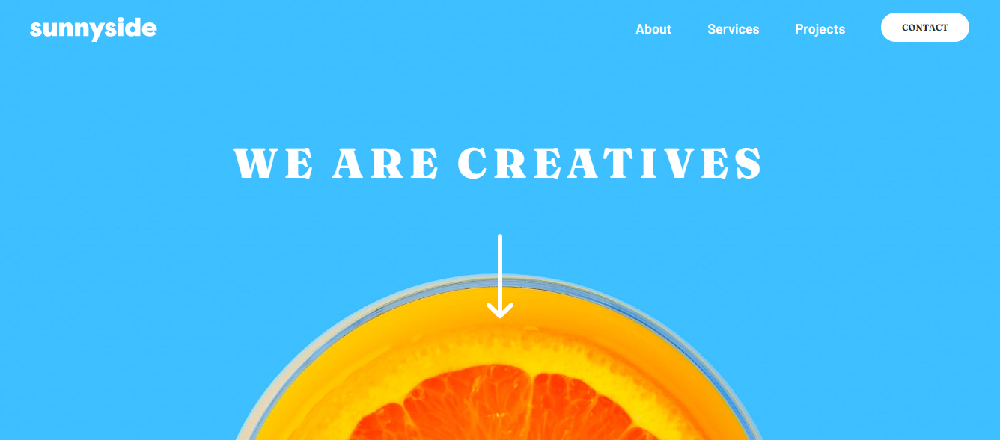
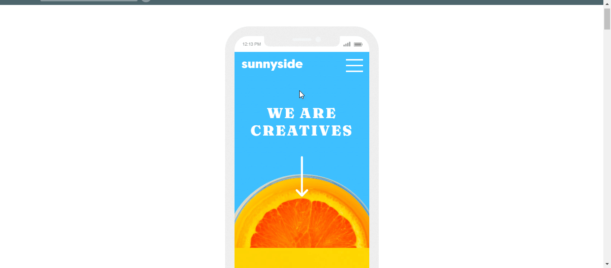

# Sunnyside Agency Landing Page 


This is my solution to the Frontend Mentor [Sunnyside Agency coding challenge](https://www.frontendmentor.io/challenges/sunnyside-agency-landing-page-7yVs3B6ef), where I used HTML, vanilla CSS, and vanilla JavaScript to create a responsive landing page as similar to the original design as possible. My mini-project also includes testing using Jest to ensure that the mobile menu content appears and disappears on-click as it should.



## Table of Contents

- [Overview](#overview)
  - [The Challenge](#the-challenge)
  - [Demo Videos](#demo-videos)
  - [Link](#link)
  - [Testing](#testing)
  - [Installation](#installation)

- [My process](#my-process)
  - [Technologies](#technologies)
  - [Features](#features)
  - [Continued Development](#continued-development)
  - [Useful Resources](#useful-resources)
  - [Author](#author)

## Overview

### The challenge

The solution includes specific design elements:

- Background images with layered text and navigation menus
- Hover states for the 'CONTACT' button in the desktop header and the coloured underline detailing on 'LEARN MORE' text
- Responsive design for mobile featuring an alternative layout and a hamburger menu

### Demo Videos  

These demo videos show the final result:




### Link
 
- Live Site URL: [Sunnyside Agency Landing Page](https://sunnyside-agency-lolamindi.netlify.app/)

### Testing 

Using Jest, I tested whether the JavaScript functions were working correctly to display and hide the mobile menu as required. All tests passed:

 ```bash
 PASS  ./function.test.js
  Menu functionality
    √ Menu content should be hidden initially (7 ms)
    √ Menu content should be displayed when checkbox is checked (5 ms)
    √ Menu content should be hidden when checkbox is unchecked (1 ms)

Test Suites: 1 passed, 1 total
Tests:       3 passed, 3 total
Snapshots:   0 total
Time:        4.979 s
Ran all test suites.
```

### Installation 

To install this project, clone or fork the repository https://github.com/lolamindi/sunnyside. 

## My Process

### Technologies 

- HTML5
- CSS3 
- JavaScript 
- Jest v29.7
- JSDOM v24.0

### Features

- CSS variables 
- Flexbox
- CSS Grid
- Desktop-first workflow
- Unit testing with Jest
- Deploy with Netlify

### Continued Development

For this project, I prioritised the desktop design as I felt it was more challenging for me with its use of background images and CSS Grid, both of which I had limited experience with. In future, though, I aim to follow a mobile-first workflow as good practice. 

After using Tailwind and Bootstrap in more recent projects, it was challenging yet motivating to use vanilla CSS again. I also aim to use it in my next project to better familiarise myself with CSS property names and their functions. I found it very useful to define CSS variables for both the colours and fonts, especially since there were so many of both in this project. This is definitely something I'll do again. 

I added unit tests to check that the JavaScript functions were working as they should, but I'd like to include integration tests or end-to-end testing in my next project.  

### Useful Resources

- [Colour Converter](https://htmlcolors.com/hsl-to-hex) - I used this to convert the HSL codes provided in the project outline to HEX values 
- [Responsive View App](http://www.responsinator.com/) - this allowed me to view what my page looked like on various mobile screen sizes 
- [CSS Tricks Flexbox Guide](https://css-tricks.com/snippets/css/a-guide-to-flexbox/)
- [CSS Tricks Grid Guide](https://css-tricks.com/snippets/css/complete-guide-grid/)

## Author 

Laura Artaza 
- [GitHub Profile](https://github.com/lolamindi)
- [LinkedIn Profile](https://www.linkedin.com/in/laura-artaza/)


